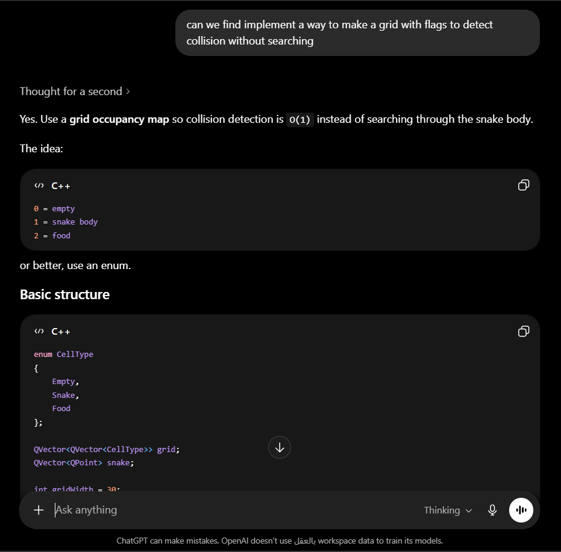
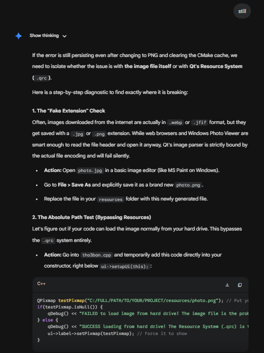

# Tho3ban++

## Group Members and IDs

| Name | ID |
|:------:|----|
| Mina Emad Ibrahim | 2300470 |
| Omar Wael Abdallah | 2300152 |
| Taqi Alrahman Ahmed Mohamed | 2300054 |
| Seif Eldin Hossam Mohamed | 2300373 |
| Mohamed Ehab Abdelbary Ibrahem | 2300570 |

## Project Description

Tho3ban++ is a Qt/C++ implementation of the classic Snake game. The player controls a snake on a 20x20 board, collects apples to increase the score, and loses when the snake collides with its own body. The project includes a main menu, a game window, score tracking, high score tracking, a timer, keyboard controls, a reset button, and a countdown before each round starts.

## Game GUI Overview

  <b>Main Menu</b> 
  
    
  <b>In-Game Action</b> 
  

## Download and Play

You can download the pre-compiled, ready-to-play Windows version of Tho3ban++ here:
* [**Download Tho3ban++ v1.0.0 (.rar)**](https://github.com/Douvakiing/tho3ban/releases/download/v1.0.0/Tho3ban_Deploy.rar)

*Note: Extract the `.rar` file and run the executable inside to play.*

## Selected Data Structures

* `deque<Position>` is used to store the snake body. The head is kept at the front and the tail at the back, which makes movement efficient because the game can push a new head and remove the tail each tick.
* `bool grid[20][20]` is used as an occupation grid for collision detection. Each cell records whether part of the snake currently occupies that position, allowing fast $O(1)$ self-collision checks.
* `Position` class is used to store x and y coordinates. It also wraps coordinates around the board limits.
* `enum class Direction` is used to represent snake movement directions clearly and safely.
* `QGraphicsScene` is used to draw the board, snake, and apple in the Qt game window.
* `QTimer` is used for the game loop and countdown timer.

## Implemented Features

* Main menu window with play and quit buttons.
* 20x20 snake game board with checkerboard background.
* Snake movement using arrow keys and WASD.
* Apple spawning in empty cells.
* Score and high score tracking.
* Self-collision game over detection.
* Countdown animation before movement starts.
* Custom snake and apple drawing using Qt graphics.

## How to Compile and Run

### Requirements
* C++ compiler with C++17 support.
* CMake 3.19 or newer.
* Qt 6.5 or newer with the `Core` and `Widgets` modules.

### Setup Instructions
1. Open **Qt Creator**.
2. Select **Open Project** and choose the `CMakeLists.txt` file.
3. Configure the project with a **Qt 6 kit**.
4. Click **Build** and then **Run**.

---

## AI Usage Declaration

* **AI Tools Used:** Cursor AI Assistant (Codex model) and ChatGPT/Gemini for debugging and logic optimization.
* **Purpose:** We utilized AI primarily for code documentation, formatting cleanup, debugging assistance, and algorithm optimization. 
* **Modifications and Rejections:** We actively reviewed and rejected the AI's first pass at commenting because it only provided superficial titles rather than explaining implementation details. We also rejected its initial diagnostic suggestions for a build error, which led us to find the root cause manually.

### Successful AI Usage: Performance Optimization
During development, we wanted to find a more efficient way to detect collisions without looping through the entire snake body on every frame. We prompted the AI for a solution, and it recommended using a **Grid Occupancy Map**. We understood that this would reduce our collision detection time complexity from $O(N)$ to $O(1)$.

### Unsuitable Output Example: Case Study in AI Diagnostic Failure

**The Problem:**
Our application compiled successfully but threw a runtime error: `"could not load pixmap"`. 

**The AI's Initial (Flawed) Diagnosis:**
The AI hypothesized that the issue was either a missing runtime image plugin (`qjpeg.dll`) or a stale CMake cache.

**The Actual Solution:**
The true fix was adding `set(CMAKE_AUTORCC ON)` to the `CMakeLists.txt`. The AI failed because it had "Blind Trust" in the `qt_standard_project_setup()` command, which was supposed to handle this automatically but failed in our specific environment.

---

### AI Usage Evidence

**1. Using AI to optimize collision detection complexity:**
 

**2. Prompting AI to standardize and fix implementation comments:**
 

 

**3. AI failing to diagnose the CMake/Resource error:**
 
