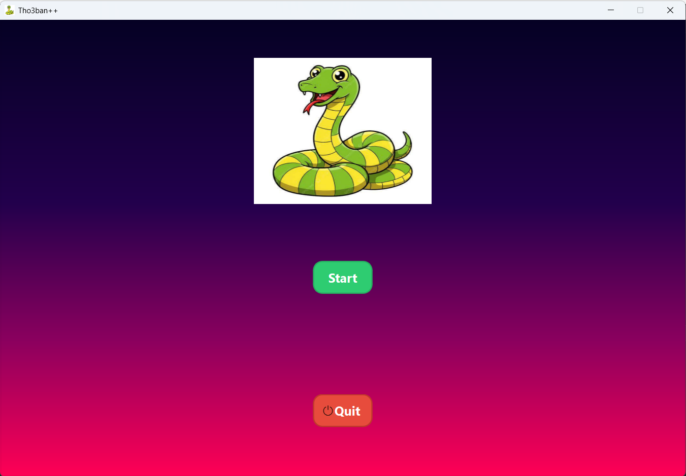
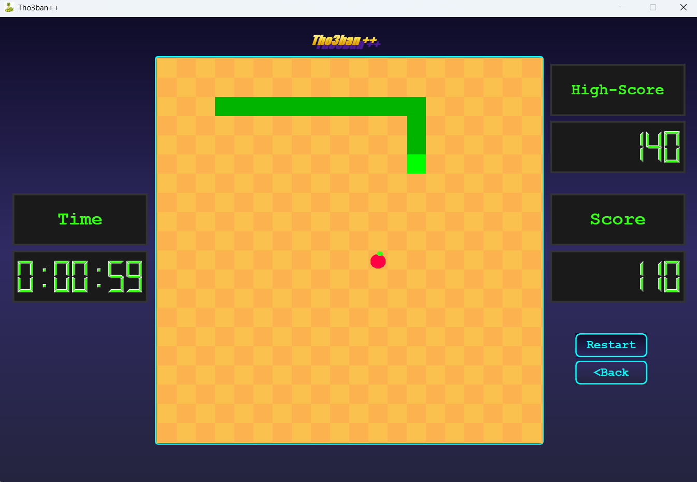
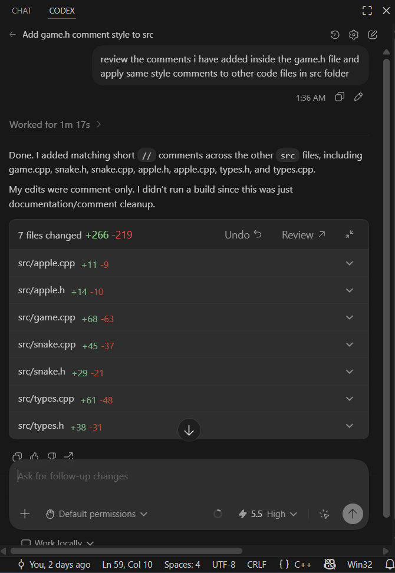
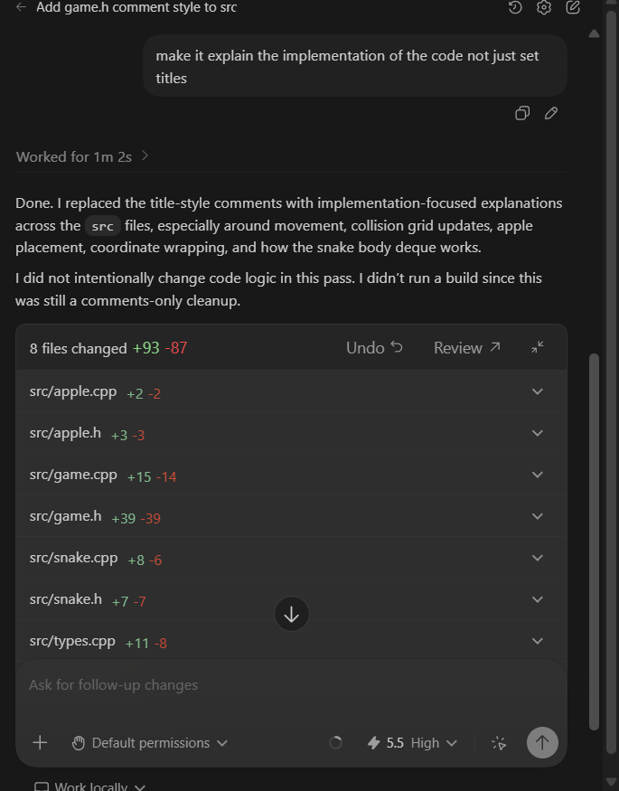

# Tho3ban++

## Group Members and IDs

| Name | ID |
|:------:|----|
| Mina Emad Ibrahim | 2300470 |
| Omar Wael Abdallah | 2300152 |
| Taqi Alrahman Ahmed Mohamed | 2300054 |
| Seif Eldin Hossam Mohamed | 2300373 |
| Mohamed Ehab Abdelbary Ibrahem | 2300570 |

## Project Description

Tho3ban++ is a Qt/C++ implementation of the classic Snake game. The player controls a snake on a 20x20 board, collects apples to increase the score, and loses when the snake collides with its own body. The project includes a main menu, a game window, score tracking, high score tracking, a timer, keyboard controls, a reset button, and a countdown before each round starts.

## Game GUI overview




## Selected Data Structures

* `deque<Position>` is used to store the snake body. The head is kept at the front and the tail at the back, which makes movement efficient because the game can push a new head and remove the tail each tick.
* `bool grid[20][20]` is used as an occupation grid for collision detection. Each cell records whether part of the snake currently occupies that position, allowing fast self-collision checks.
* `Position` class is used to store x and y coordinates. It also wraps coordinates around the board limits, so moving past an edge continues from the opposite side.
* `enum class Direction` is used to represent snake movement directions clearly and safely.
* `QGraphicsScene` is used to draw the board, snake, and apple in the Qt game window.
* `QTimer` is used for the game loop and countdown timer.

## Implemented Features

* Main menu window with play and quit buttons.
* 20x20 snake game board.
* Snake movement using arrow keys and WASD.
* Apple spawning in empty cells.
* Score increases when the snake eats an apple.
* High score display.
* Self-collision game over detection.
* Reset button to restart the round.
* Back button to return to the main menu.
* Game timer display.
* Countdown animation before movement starts.
* Checkerboard board background.
* Custom snake and apple drawing using Qt graphics.

## How to Compile and Run

### Requirements

* C++ compiler with C++17 support.
* CMake 3.19 or newer.
* Qt 6.5 or newer with the `Core` and `Widgets` modules.
* Qt Creator is recommended for easiest setup.

### Run Using Qt Creator

1. Open Qt Creator.
2. Choose **Open Project**.
3. Select the `CMakeLists.txt` file from this project folder.
4. Configure the project with a Qt 6 kit.
5. Click **Build**.
6. Click **Run**.

### Compile and Run From Command Line

From the project root folder:

```bash
cmake -S . -B build
cmake --build build
```

After building, run the generated executable from the build folder. On Windows, the executable is usually located in a configuration subfolder such as:

```bash
build/Debug/tho3ban.exe
```

or:

```bash
build/Release/tho3ban.exe
```

If CMake cannot find Qt, make sure the Qt `bin` directory is added to your `PATH`, or configure the project through Qt Creator.

## AI Usage Declaration

* **AI Tools Used:** Google Gemini ,Chatgpt and Cursor AI Assistant (Codex model) .
* **Purpose:** We utilized the AI primarily for code documentation and formatting cleanup. It was used to propagate a consistent commenting style across the header and source files in our `src` directory.
* **Modifications and Rejections:** We actively reviewed and rejected the AI's first pass at commenting because it only provided superficial, "title-style" comments. We had to modify our instructions to force the AI to explain the actual implementation details.
* **Unsuitable Output Example:** Initially, the AI generated very basic section labels that did not explain how the code worked. This output was unsuitable for our documentation standards. As shown in the screenshots below, we had to explicitly prompt the AI to *"make it explain the implementation of the code not just set titles."* Only then did it provide useful documentation about our collision grid updates, coordinate wrapping, and deque operations.
* **What We Understood and Implemented Ourselves:** Our group fully designed, wrote, and debugged the core game logic, the Qt UI, and the integration of our chosen data structures (the `deque` for snake movement and the 2D boolean grid for collisions). The AI did not write or alter our game logic; it only assisted in documenting the logic we had already built.

### AI Usage Evidence

**Prompting AI to standardize comment styling across files:**
 

**Correcting AI's unsuitable output to focus on implementation details:**
